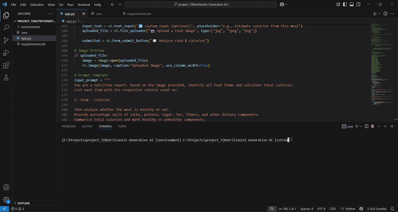

# 🥗 Gemini Health Nutrition Analyzer

This is an AI-powered health management app built using **Google Gemini Vision** and **Streamlit**. It helps users analyze food from images, estimate calories, and evaluate nutritional content (carbs, fats, protein, sugar, etc.).

---

## 📽️ Demo



> *Watch the app in action! Upload food images and instantly get nutritional insights.*

---

## 🚀 Features

- 📷 Upload food images  
- 🧠 Powered by **Gemini Pro Vision**  
- 🍽️ Get per-item calorie count  
- ✅ Classifies meals as healthy/unhealthy  
- 🧪 Shows macro and micronutrient breakdown  
- 💡 Custom input prompt support  

---

## 🛠️ Tech Stack

- Python  
- Streamlit  
- Google Generative AI (Gemini API)  
- Pillow (PIL)  
- dotenv  

---

## 💻 How to Run

```bash
# 1. Clone the repo
git clone https://github.com/yourusername/gemini-health-app.git
cd gemini-health-app

# 2. Install dependencies
pip install -r requirements.txt

# 3. Add your API key
# Create a .env file with:
GOOGLE_API_KEY=your_api_key

# 4. Run the app
streamlit run app.py
